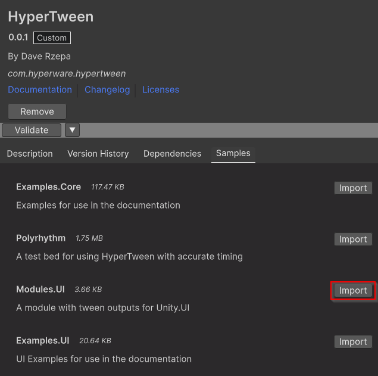

# Modules

Currently, HyperTween has very few tween output components as the framework is still experimental and creating your own is designed to be as simple as possible. Additionally, adding more tween outputs does potentially add overhead as it increases the number of systems present.

For this reason, HyperTween is designed to be modular, so it possible to only import the components you actually need. This can be done by importing the modules from the Samples tab in the Unity package manager:

