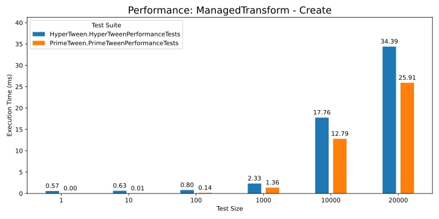
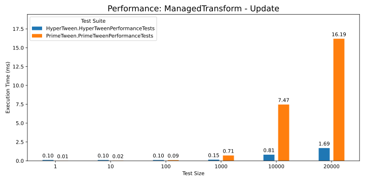
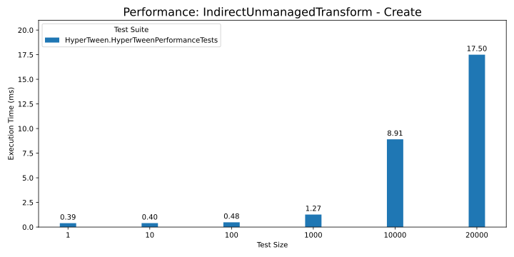
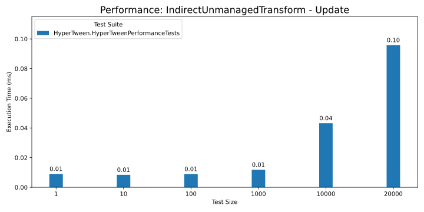
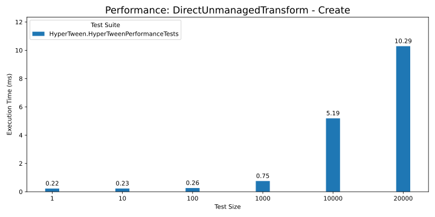
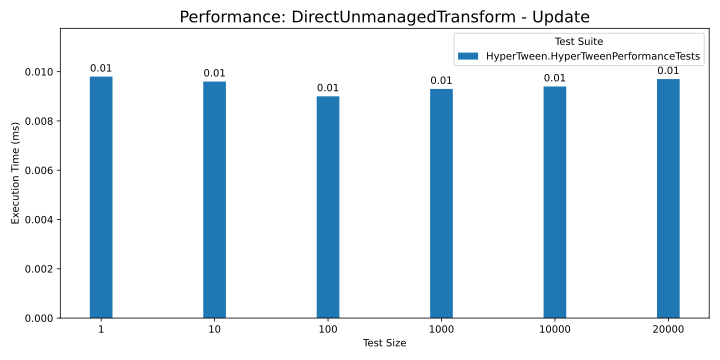

# Performance

Currently, HyperTween has only been benchmarked against [PrimeTween](https://github.com/KyryloKuzyk/PrimeTween)

At the time of writing, [MagicTween](https://github.com/AnnulusGames/MagicTween) is not compatible with the latest version of Unity, so I was unable to compare against it.

These benchmarks were performed on an ASUS TUF Gaming F15, 12th Gen Intel(R) Core(TM) i7-12700H (20 CPUs), ~2.3GHz, with the machine plugged into the power supply, using the IL2CPP scripting backend.

The broad trend is that HyperTween is significantly faster than PrimeTween when operating in a pure ECS context.

When working with managed Transforms, PrimeTween has a slight edge in terms of tween creation times, however in terms of updating tweens HyperTween is still significantly faster. It is also important to note that HyperTween can create tweens in a job off of the main thread, meaning that other work can be taking place during tween creation.

In the graphs below Direct vs Indirect refers to tweens that output to a LocalTransform on the same entity vs tweens that output to a different entity. Direct tweens update slightly faster because they can employ sequential memory access when writing to the LocalTransform, however the difference is more negligible than expected.

